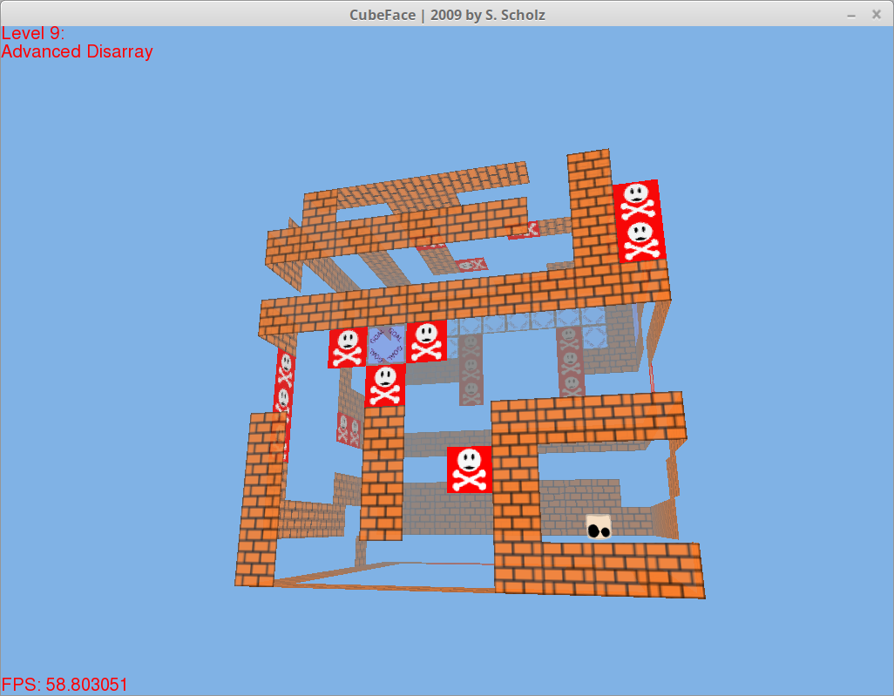

# cpp-games
2D/3D-Graphics games and simulations in C++/OpenGL

Please note: I programmed these games and simulations back when I was about 15 years old. The code is thus sometimes not as pretty as it should be. Nonetheless, I'm extremely proud about all the stuff I created back then.

## Game: "JaR" ("Jump and Run"), 2008

My first major game. The idea was to jump up to the goal in each level, and then reach the bottom of the level again, but without being able to jump.

## Game: "Falling Down", 2008

A simple little game. Just move quickly and let the ball fall through the gaps.

## Modelling tool: "ObjectSimulator", 2009

This was my very first 3D project, and I didn't even know anything about OpenGL back then. Instead, I programmed all the required math myself and drew all the lines/pixels manually onto the screen using SDL. Perhaps my most ambitious project back then.

This project started as a little competition between me and my computer science teacher about who could program the more awesome 3D visualization application. (I won.)

## Game: "CubeFace", 2009

My first major OpenGL project.

I loved the idea of this game: It's a 2D platformer, on top of the six sides of a 3D cube. This was a really fun game!

## Particle physics simulation: "ParticleWorld", 2009

In order to understand physical forces better, I implemented little simulation that simulated little particle movements based on some basic physical forces (e.g. gravity, or a simple linear force).

## Game: "Philosophy of Yourself", 2010

For my philosophy course at high school I implemented this little game. The theme was "the meaning of life".
In this game you jump through levels. Each block you jump on shows a little thought. Thus each level represents a little line of thought related to the meaning of life.

For the intro screen I used some parts of the particle system I implemented the year earlier:

For the main menu I recursively divided a polygon into many random pieces, creating pretty patterns:

Here you can see the protagonist jumping between blocks, each of which representing a little thought:

